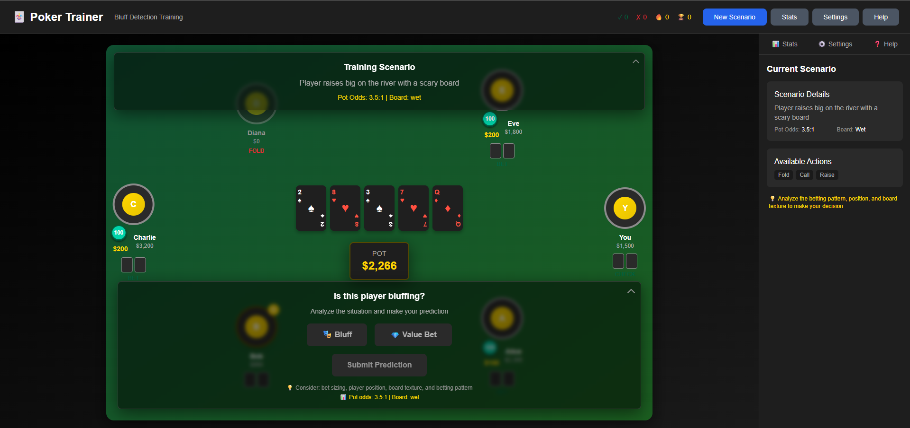

# Poker Trainer - Bluff Detection

A desktop application for training poker players in bluff detection using machine learning. Built with Electron, React, TypeScript, and Tailwind CSS.



## Features

- **AI-Powered Training**: Machine learning model analyzes poker scenarios and provides feedback
- **Realistic Poker Interface**: Beautiful poker table UI with animated cards and chips
- **Interactive Training**: Hands-on bluff vs. value bet detection scenarios
- **Progress Tracking**: Comprehensive statistics and performance analytics
- **Multiple Difficulty Levels**: Easy, Medium, and Hard training scenarios
- **Real-time Feedback**: Instant results with AI confidence scores
- **Customizable Settings**: Adjust difficulty, scenario types, and UI preferences

## Quick Start

```bash
# Install pnpm globally (if not already installed)
npm install -g pnpm

# Clone and setup the project
git clone https://github.com/Rama4/poker-trainer.git
cd poker-trainer
pnpm install

# Start development
pnpm dev
```

## Getting Started

### Prerequisites

- **Node.js** (v18.0.0 or higher)
- **pnpm** (v8.0.0 or higher) - Install with `npm install -g pnpm`
- **Git**

### Installation

1. **Clone the repository**

   ```bash
   git clone https://github.com/Rama4/poker-trainer.git
   cd poker-trainer
   ```

2. **Install dependencies**

   ```bash
   pnpm install
   ```

3. **Set up environment variables** (optional)
   ```bash
   # Create .env file for API configuration
   echo "API_URL=http://localhost:8000/api" > .env
   ```

### Development

1. **Start the development server**

   ```bash
   pnpm dev
   ```

   This will start both the React development server and Electron simultaneously.

2. **The application will open automatically** in a new Electron window

### Building for Production

1. **Build the React application**

   ```bash
   pnpm build
   ```

2. **Build the Electron application**

   ```bash
   pnpm build:electron
   ```

3. **Find the built application** in the `release/` directory

## How to Use

### Basic Training Flow

1. **Launch the application** - A training scenario will load automatically
2. **Analyze the situation** - Review the poker table, community cards, and player actions
3. **Read the scenario description** - Understand the context and betting pattern
4. **Make your prediction** - Choose "Bluff" or "Value Bet"
5. **Set confidence level** - Adjust the slider to indicate how sure you are
6. **Submit your answer** - Get instant feedback from the AI model
7. **Review results** - Learn from the explanation and move to the next scenario

### Understanding the Interface

#### Main Poker Table

- **Player Positions**: 6 players arranged around an oval table
- **Community Cards**: Up to 5 cards in the center (Flop, Turn, River)
- **Pot Display**: Current pot size in the center
- **Suspicious Player**: Highlighted with red border and warning indicator
- **Dealer Button**: White "D" button shows dealer position

#### Action Panel (Bottom)

- **Prediction Buttons**: Choose between Bluff (🎭) or Value Bet (💎)
- **Confidence Slider**: Set your confidence level (50-100%)
- **Submit Button**: Send your prediction to the AI model
- **Hints**: Helpful tips about pot odds and board texture

#### Sidebar Panels

- **Stats**: Track your accuracy, streaks, and improvement
- **Settings**: Customize difficulty, audio, and visual preferences
- **Help**: Comprehensive guide and keyboard shortcuts

### Training Tips

#### Analyzing Bluffs

1. **Bet Sizing**: Large bets (2x+ pot) often indicate bluffs
2. **Position**: Late position allows for more bluffing opportunities
3. **Board Texture**: Wet boards (coordinated) favor bluff attempts
4. **Timing**: Quick bets after scare cards suggest bluffs
5. **Player Type**: Tight players bluff less, loose players bluff more

#### Key Indicators

- **Likely Bluffs**: Oversized bets, sudden aggression, betting into multiple opponents
- **Likely Value**: Standard sizing, consistent aggression, strong board connections

## Architecture

### Directory structure

```
poker-trainer/
├── electron/           # Electron main process
│   ├── main.ts        # Main Electron process
│   └── preload.ts     # Preload script
├── src/               # React application
│   ├── components/    # UI components
│   ├── store/         # Redux store and slices
│   ├── services/      # API services
│   └── main.tsx       # React entry point
├── dist/              # Built React app
└── release/           # Built Electron app
```

### Tech Stack

- **Frontend**: React 18, TypeScript, Tailwind CSS
- **Desktop**: Electron 27
- **State Management**: Redux Toolkit
- **Build Tool**: Webpack 5
- **HTTP Client**: Axios
- **Styling**: Tailwind CSS with custom poker theme

### API Integration

The application is designed to work with a backend API that provides:

```typescript
// Training scenarios endpoint
GET / api / training / scenario;
POST / api / training / predict;

// User statistics
GET / api / user / stats;
PUT / api / user / settings;

// Player data
GET / api / game / players;
```

## License

This project is licensed under the MIT License - see the [LICENSE](LICENSE) file for details.
